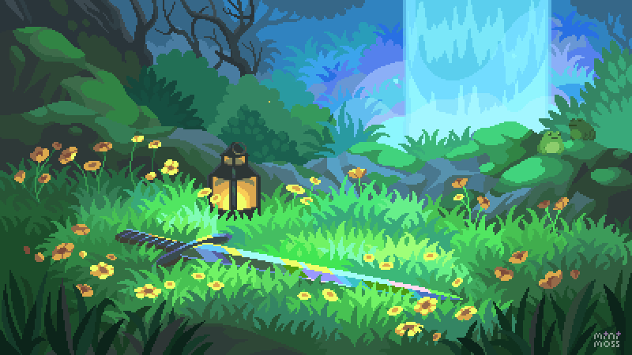

<p align="center">
  
</p>

<p align="center">
  
</p>

<h1 align="center">Mirabile</h1>

<p align="center">
  AI-powered career roadmap platform that generates personalised, company-specific learning journeys for engineering roles.
</p>

<p align="center">
  
  
  
  
  
  
</p>


## Demo

https://github.com/user-attachments/assets/1596a4be-87d6-4c78-8636-006bce7be2ce

## Pipeline


---

## Table of Contents

- [Overview](#overview)
- [Features](#features)
- [Tech Stack](#tech-stack)
- [Project Structure](#project-structure)
- [Getting Started](#getting-started)
- [Environment Variables](#environment-variables)
- [Edge Functions](#edge-functions)
- [AI Models](#ai-models)
- [YouTube Integration](#youtube-integration)
- [Achievements System](#achievements-system)
- [CI/CD Pipeline](#cicd-pipeline)
- [Contributing](#contributing)

---

## Overview

Mirabile is an AI agent lives in the Mirabile ecosystem that takes three inputs:
a career goal, a target company, and a timeline to generate a complete roadmap
tailored to that exact combination, broken into 6 phases: Foundation,
Intermediate, Advanced, Data Structures & Algorithms, System Architecture, and
Interview Preparation

---

## Features

- **Multi-model AI generation** — generate roadmaps with OpenAI, Claude, or
  Gemini
- **Company-specific roadmaps** — content tailored to a target company's tech
  stack, culture, and interview format
- **Real YouTube resources** — videos fetched server-side via YouTube Data API
  v3, scoped by role and phase to curated channels
- **Progress tracking** — track completed steps, streaks, and milestones per
  roadmap
- **Achievements system** — 10 unlockable achievements based on real activity
- **Activity dashboard** — daily progress chart, trending tech news, active
  roadmap cards
- **Hacker News feed** — top tech stories cached daily via the HN API with
  Unsplash cover images
- **Dark mode UI** — custom glass-morphism design system
- **CI/CD pipeline** — automated build, test, code quality, security, and deployment via Jenkins

---

## Tech Stack

| Layer           | Technology                            |
| --------------- | ------------------------------------- |
| Frontend        | React, TypeScript, Tailwind CSS, Vite |
| Routing         | React Router                          |
| Backend         | Supabase Edge Functions (Deno)        |
| Database        | Supabase (PostgreSQL)                 |
| Auth            | Supabase Auth                         |
| AI — OpenAI     | GPT via OpenAI API                    |
| AI — Anthropic  | Claude via Anthropic API              |
| AI — Google     | Gemini via Google Vertex AI           |
| Video resources | YouTube Data API v3                   |
| Charts          | Recharts                              |
| Icons           | Lucide React                          |
| CI/CD           | Jenkins (Declarative Pipeline)        |
| Containerisation| Docker, Docker Compose                |
| Code Quality    | SonarQube, SonarScanner               |
| Security        | OWASP Dependency-Check                |
| Testing         | Selenium IDE, selenium-side-runner, Jest, jest-junit |
| Monitoring      | Datadog Events API                    |

---

## Project Structure

```
mirabile/
├── src/
│   ├── assets/
│   │   └── images/cards/          # Company cover images (Google, Meta, etc.)
│   ├── components/
│   │   └── ui/                    # Shared UI components
│   ├── constants/
│   │   ├── aiModels.ts            # AI model registry
│   │   └── companyBranding.ts     # Brand colours per company
│   ├── contexts/
│   │   ├── RoadmapContext.tsx
│   │   └── ProgressContext.tsx
│   ├── pages/
│   │   ├── DashboardPage.tsx
│   │   ├── ProgressPage.tsx
│   │   └── ...
│   └── lib/
│       └── supabase.ts
├── supabase/
│   └── functions/
│       └── generate-roadmap/
│           ├── index.ts           # Main edge function handler
│           ├── google_oauth.ts    # GCP service account auth
│           └── lib/
│               ├── prompt.ts      # LLM prompt builders
│               ├── json.ts        # Safe JSON parser
│               ├── youtube.ts     # YouTube Data API v3 search
│               ├── youtube-resources.ts  # Per-step video fetching
│               ├── llm/
│               │   ├── openai.ts
│               │   ├── claude.ts
│               │   └── gemini.ts
│               └── db/
│                   ├── insert-roadmap.ts
│                   ├── insert-steps.ts
│                   ├── insert-resources.ts
│                   └── insert-progress.ts
├── tests/
│   └── *.side                     # Selenium IDE test suites
├── reports/
│   └── dependency-check/          # OWASP scan output (HTML + XML)
├── test-results/
│   └── junit.xml                  # Jest test report
├── jest.config.cjs                # Jest config (forceExit + jest-junit reporter)
├── docker-compose.staging.yml     # Staging environment definition
├── Dockerfile                     # Nginx-based production image
├── Jenkinsfile                    # Declarative CI/CD pipeline
└── public/
    └── icons/                     # Company logo icons
```

---

## Getting Started

### Prerequisites

- Node.js 18+
- [Supabase CLI](https://supabase.com/docs/guides/cli)
- A Supabase project
- API keys for at least one AI provider

### Installation

```bash
git clone https://github.com/Stewie-pixel/mirabile.git
cd mirabile
npm install
```

### Local development

```bash
# Start the frontend
npm run dev
 
# Serve edge functions locally
supabase functions serve generate-roadmap --env-file .env.local
```

---

## Environment Variables

### Frontend — `.env`

```env
VITE_SUPABASE_URL=https://your-project-ref.supabase.co
VITE_SUPABASE_ANON_KEY=your_anon_key
VITE_UNSPLASH_ACCESS_KEY=your_unsplash_key
```

### Edge functions — `.env.local`

```env
SUPABASE_URL=https://your-project-ref.supabase.co
SUPABASE_ANON_KEY=your_anon_key
 
# AI providers (add at least one)
LLM_API_KEY=your_openai_key
CLAUDE_API_KEY=your_claude_key
 
# Google Vertex AI (for Gemini)
GCP_SERVICE_ACCOUNT={"type":"service_account",...}
GCP_PROJECT_ID=your_project_id
GCP_LOCATION=us-central1
 
# YouTube Data API v3
YOUTUBE_API_KEY=your_youtube_key
```

### Setting secrets on Supabase

```bash
supabase secrets set LLM_API_KEY=your_key
supabase secrets set CLAUDE_API_KEY=your_key
supabase secrets set YOUTUBE_API_KEY=your_key
supabase secrets set GCP_SERVICE_ACCOUNT='{"type":"service_account",...}'
supabase secrets set GCP_PROJECT_ID=your_project_id
 
# Verify
supabase secrets list
```

---

## Edge Functions

### `generate-roadmap`

The main function that handles the full roadmap generation pipeline:

1. Authenticates the user via Supabase Auth
2. Routes the request to the selected AI provider (OpenAI, Claude, or Gemini)
3. Runs a two-stage prompt — structure first, resources second
4. Inserts roadmap, steps, resources, and progress into the database
5. Fetches a real YouTube video per step via the YouTube Data API v3

```bash
# Deploy
supabase functions deploy generate-roadmap
 
# Logs
supabase functions logs generate-roadmap --tail
```

---

## AI Models

Models are registered in `src/constants/aiModels.ts`. Each model has a
`provider` and `modelId`:

| Key                 | Provider | Model                      |
| ------------------- | -------- | -------------------------- |
| `gpt-4o`            | openai   | gpt-4o                     |
| `gpt-4o-mini`       | openai   | gpt-4o-mini                |
| `claude-3-5-sonnet` | claude   | claude-3-5-sonnet-20241022 |
| `gemini-1.5-pro`    | gemini   | gemini-1.5-pro             |

The prompt pipeline is split into two stages:

- `buildStructurePrompt` — generates 6 phases and 18 steps
- `buildResourcesPrompt` — generates articles, courses, and documentation per
  step (videos handled separately)

---

## YouTube Integration

Videos are fetched server-side after AI generation using the YouTube Data API
v3. Each step gets one video scoped to a curated channel list based on the
career role and roadmap phase.

**Quota usage:** 100 units per search × 18 steps = **1,800 units per roadmap**.
The free tier allows 10,000 units/day (~5 roadmaps/day). A caching layer is
recommended before scaling.

**Channel mapping by role:**

| Role                 | Channels                                               |
| -------------------- | ------------------------------------------------------ |
| Frontend             | WebDevSimplified, Fireship, VercelHQ, ChromeDevelopers |
| Backend              | husseinalnasser, TechWithTim, Fireship                 |
| ML                   | Statquest, TensorFlow, googledeepmind                  |
| DevOps               | GoogleCloudTech, AzureDevOps, awsdevelopers            |
| Mobile               | Android, AppleDeveloper                                |
| DSA phases           | NeetCode, CSDojo, ByteByteGo                           |
| System Design phases | ByteByteGo, husseinalnasser, GoogleDevelopers          |
| Interview phases     | NeetCode, TechLead, ByteByteGo                         |

To get a YouTube API key:

1. Go to [Google Cloud Console](https://console.cloud.google.com)
2. Enable **YouTube Data API v3**
3. Create an API key under Credentials
4. Run `supabase secrets set YOUTUBE_API_KEY=your_key`

---

## Achievements System

Achievements are checked and unlocked by calling
`checkAndUnlockAchievements(userId)` after qualifying actions. All date
calculations use UTC to avoid timezone bugs.

| Key               | Name               | Condition                                   |
| ----------------- | ------------------ | ------------------------------------------- |
| `first_spark`     | First Spark 🔥     | Complete your first step                    |
| `pathfinder`      | Pathfinder 🗺️      | Create your first roadmap                   |
| `summit_reached`  | Summit Reached 🏔️  | Complete an entire roadmap                  |
| `on_a_roll`       | On a Roll ⚡       | 7-day activity streak                       |
| `overachiever`    | Overachiever 🏆    | Complete 3 roadmaps                         |
| `ai_collaborator` | AI Collaborator 💬 | Ask 5 questions to the AI assistant         |
| `fast_learner`    | Fast Learner ⚡    | Complete 5 steps in a single day            |
| `explorer`        | Explorer 🚀        | Generate 5 roadmaps for unique career goals |
| `perseverance`    | Perseverance 💪    | Complete 10 steps total                     |
| `night_owl`       | Night Owl 🦉       | Complete a step between 11 PM and 4 AM UTC  |

---

## CI/CD Pipeline

Mirabile uses a Jenkins declarative pipeline defined in `Jenkinsfile` at the repository root. The pipeline runs on a Windows agent and covers 8 stages from build through to production deployment and monitoring.

### Pipeline Overview

```
Build → Test → Code Quality → Quality Gate → Security → Deploy → Release → Monitoring
```

### Prerequisites

The following tools must be installed and configured on the Jenkins agent:

- Docker Desktop
- Node.js (added to `PATH`)
- Java 21 (added to `PATH`, required for OWASP Dependency-Check)
- SonarScanner CLI
- Jenkins plugins: SonarQube Scanner, OWASP Dependency-Check, Datadog

### Jenkins Setup

1. In Jenkins, create a new **Pipeline** job
2. Set **Definition** to `Pipeline script from SCM`
3. Point SCM to this repository and set **Script Path** to `Jenkinsfile`
4. Under **Manage Jenkins → Global Tool Configuration**, configure:
   - SonarQube Scanner installation
   - OWASP Dependency-Check installation named `OWASP-Dependency-Check`
5. Under **Manage Jenkins → Configure System**, add a SonarQube server named `SonarQube`
6. Add the following Jenkins credentials:
   - `datadog-api-key` — Datadog API key (Secret text)

### Stage Descriptions

| # | Stage | Description | Tools |
|---|-------|-------------|-------|
| 1 | **Build** | Builds a versioned Docker image tagged with the build number and `latest` | Docker |
| 2 | **Test** | Runs Selenium IDE test suites via selenium-side-runner; publishes JUnit results | Selenium IDE, Jest, jest-junit |
| 3 | **Code Quality** | Static analysis scan of `src/` excluding node_modules and dist | SonarQube, SonarScanner |
| 4 | **Quality Gate** | Waits up to 2 minutes for SonarQube quality gate; aborts pipeline on failure | SonarQube |
| 5 | **Security** | Scans dependencies for CVEs; publishes HTML and XML vulnerability reports | OWASP Dependency-Check |
| 6 | **Deploy** | Starts staging environment via Docker Compose on port 3001; health-checks with curl | Docker Compose |
| 7 | **Release** | Manual approval gate; promotes versioned image to production on port 3000 | Docker |
| 8 | **Monitoring** | Sends deployment event to Datadog; fires failure event if pipeline fails | Datadog Events API |

### Running the Pipeline

```bash
# Trigger via Jenkins UI
# Navigate to your pipeline job → Build Now

# Or trigger via Jenkins CLI
java -jar jenkins-cli.jar -s http://localhost:8080 build Mirabile
```

### Test Configuration

Selenium tests live in the `tests/` directory as `.side` files. Jest is configured via `jest.config.cjs`:

```js
module.exports = {
  forceExit: true,
  reporters: [
    "default",
    ["jest-junit", {
      outputDirectory: "test-results",
      outputName: "junit.xml"
    }]
  ]
}
```

### Environment Variables (Jenkins)

The following environment variables are set in the pipeline:

| Variable | Value |
|----------|-------|
| `IMAGE_NAME` | `mirabile` |
| `STAGING_PORT` | `3001` |
| `PROD_PORT` | `3000` |
| `STAGING_CONTAINER` | `mirabile-staging` |
| `PROD_CONTAINER` | `mirabile-prod` |
| `JAVA_HOME` | Path to Java 21 installation |

---

## Contributing

1. Fork the repo
2. Create a feature branch: `git checkout -b feat/your-feature`
3. Commit your changes: `git commit -m 'feat: add your feature'`
4. Push to the branch: `git push origin feat/your-feature`
5. Open a pull request

---

## License

MIT @ Stewie-pixel 2026 All rights reserved.
